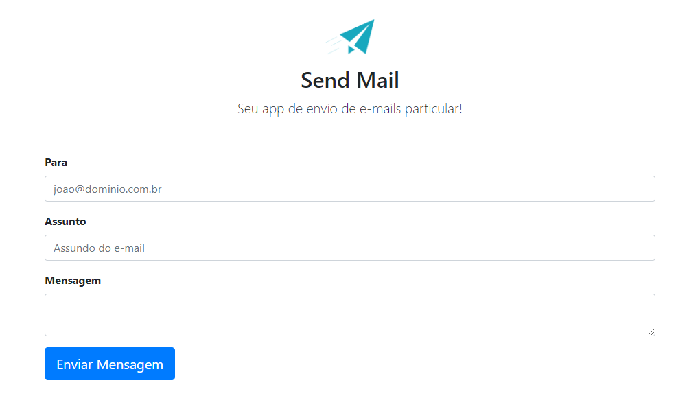

# SendMail
Bem-vindo ao SendMail, um aplicativo web simples para enviar e-mails usando HTML, CSS, JavaScript e PHP. 

## Visão Geral

O SendMail é uma aplicação web de envio de e-mails. Com uma interface intuitiva, permite que os usuários redijam e enviem e-mails de forma fácil e rápida.

## Tecnologias Utilizadas

- **HTML5**: Estruturação da interface do usuário.
- **CSS3**: Estilização para uma experiência visual atraente.
- **JavaScript**: Melhorias interativas na interface do usuário.
- **PHP**: Lógica do lado do servidor para envio de e-mails.

## Recursos

- Formulário simples para compor e enviar e-mails.
- Visualização rápida do status de envio.

## Capturas de Tela



## Como Usar

1. Configure um servidor web compatível com PHP.
2. Faça o upload dos arquivos para o seu servidor.
3. Configure as credenciais do servidor de e-mail em `send.php`.
4. Acesse a aplicação através do navegador.

## Configuração do Servidor SMTP

Configure as credenciais do servidor de e-mail no arquivo `send.php` no diretório `server/`.

```php
<?php
// Configurações do servidor SMTP
$mail->Host = 'seu_servidor_smtp';
$mail->Username = 'seu_nome_de_usuario_smtp';
$mail->Password = 'sua_senha_smtp';
$mail->Port = 'sua_porta_smtp';
```

## Contribuições

1. Faça um fork do repositório.
2. Clone o fork para a sua máquina local.
3. Faça suas modificações e adições.
4. Envie um pull request para revisão.

## Estrutura do Projeto

- `server/`: Código-fonte do servidor e bibliotecas necessárias (PHP).
- `img/`: Recursos como imagens.
- `js/`: Código-fonte personalizado de JavaScript.
- `css/`: Código-fonte personalizado de CSS.
- `index.php`: Página home (lado do cliente).


## Agradecimentos

Obrigado por contribuir com o SendMail! Esperamos que esta ferramenta torne o envio de e-mails mais rápido e conveniente. Relate problemas, sugira melhorias ou contribua com código para aprimorar ainda mais o aplicativo.

Esperamos que o SendMail facilite sua comunicação por e-mail!
